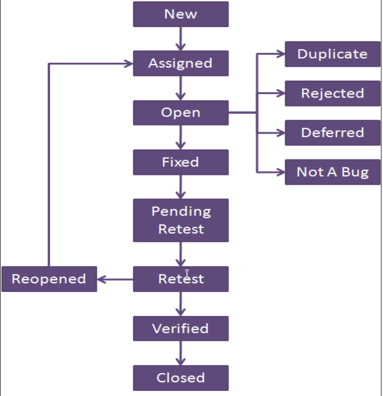

# Exercise 5

## 1. replace with key terms

1. Black-box testing technique used very useful for designing acceptance tests with customer/user participation.
2. The time gap between date of detection & date of closure
3. Black-box testing technique useful for testing the implementation of system requirements that specify how different combinations of conditions result in different outcomes
4. Testing technique where informal (not pre-defined) tests are designed, executed, logged, and evaluated dynamically during test execution. The test results are used to create tests for the areas that may need more testing
5. Type of testing is used to focus effort required during testing. It is used to decide where/when to start testing and identify areas that need more attention
6. Tool used to establish and maintain integrity of work products (components, data and documentation) of the system through the whole life cycle
7. Black-box testing technique used only when data is numeric or sequential
8. divides data into partitions in such a way that all the members of a given partition are expected to be processed in the same way.
9. is an extension of (EP) equivalence partitioning that can ONLY be used when: 
  - the partition is ordered.
  - consisting of numeric or sequential data.
10. allows the tester to view the software in terms of its states, transitions between states, the inputs or events that trigger state changes (transitions) and the resulting actions.
11. exercises the executable statements in the code.
12. - is measured as the number of executable statements executed by the tests divided by the total number of executable statements in the test object, normally expressed as a percentage.
    - is measured as the number of decision outcomes executed by the tests divided by the total number of decision outcomes in the test object, normally expressed as a percentage. 
13. exercises the decisions in the code and tests the code that is executed based on all decision outcomes.
14. find out the minimum number of paths which will ensure covering of all the edges.
15. is where tests are derived from the tester’s skill and insight and their experience with similar applications and technologies.
16. enumerate a list of possible defects and to design tests that attack these defects.
17. is sometimes conducted using session-based testing to structure the activity within a defined time-box, based on a test charter containing test objectives.
18. involves situations that, should they occur, may have a negative effect on a project's ability to achieve its objectives.
19. involves the possibility that a work product may fail to satisfy the legitimate needs of its users/stakeholders.
20. The time gap between date of detection & date of closure.
21. Life cycle which a bug goes through during its lifetime, from its discovery to fixation.
22. find out the shortest number of paths following which all the nodes will be covered.

>> 1. `usecase testing`
>> 2. `defect age`
>> 3. `decision table testing`
>> 4. `exploratory testing`
>> 5. `risk based testing`
>> 6. `configuration management`
>> 7. `boundary value analysis`
>> 8. `Equivalence partitioning`
>> 9. `Boundary value analysis (BVA)`
>> 10. `State transition testing`
>> 11. `Statement testing`
>> 12. `Coverage`
>> 13. `Decision testing`
>> 14. `Branch Coverage`
>> 15. `Experience based testing`
>> 16. `error guessing technique`
>> 17. `Exploratory testing`
>> 18. `Project risk`
>> 19. `Product risk`
>> 20. `Defect Age`
>> 21. `Bug life cycle`
>> 22. `Statement Coverage`

## 2. Identify Type of Project Risk

1. Test environment not ready on time
2. Skill, training and staff shortages
3. contractual issues
4. Improper attitude such as not appreciating the value of finding
  defects during testing
5. Low quality of the design, code, or configuration data

>> 1. `technical issues`
>> 2. `organizational factors`
>> 3. `supplier issues`
>> 4. `organizational factors`
>> 5. `technical issues`

## 3. identify Approach used in Testing Tool

1. Generic script processes action words describing the actions to be
  taken, which then calls scripts to process the associated test data
2. Separate out the test inputs and expected results, usually into a
  spreadsheet, and uses a more generic test script that can read the
  input data and execute the same test script with different data.
3. Enable a functional specification to be captured in the form of a
  model, such as an activity diagram. This task is generally performed
  by a system designer.

>> 1. `keyword-driven testing approach`
>> 2. `data-driven testing approach`
>> 3. `model-based testing`

## 4. How to measure the decision testing coverage?

> `Coverage` is measured as the number of decision outcomes executed by the
> tests divided by the total number of decision outcomes in the test object

## 5. When exploratory testing is most appropriate?

> Most useful where:
>
> - there are few or inadequate specifications
> - severe time pressure

## 6. What is the common minimum coverage standard for decision table testing?

> to have at least one test case per decision rule in the table.

## 7. To achieve 100% coverage in equivalence partitioning, test cases must cover all identified partitions by using **`(one value)`** . Complete.

## 8. Statement and decision testing are most commonly used at the **`(component)`** test level. Complete.

## 9. Risk level of an event can be determined based on **`( Likelihood/probability of an event happening)`** and **`(Impact/harm resulting from event)`** . Complete.

## 10. Who is responsible for testing in following test levels: operation acceptance/ unit/ system testing.

| level                  | responsibility (done by)                            |
| ---------------------- | --------------------------------------------------- |
| component integration  | developer                                           |
| system integration     | independent test team                               |
| operational acceptance | operations/systems administration staff             |
| user acceptance        | business analyst , subject matter experts and users |

## 11. Contrast benefits and drawbacks of hiring independent testers.

- benefits
  - testers are unbiased and see other and different defects
  - testers can verify assumptions made by people during specification and implementation of the system
- drawbacks
  - isolation from development team
  - developers may lose sense of responsibility for quality
  - testers may be seen as bottleneck for release

## 12. Resulting product risk information is used to guide test activities. Elaborate.

- determine the test techniques to be employed.
- determine the extent of testing to be carried out.
- prioritize testing to find the critical defects as early as possible.
- determine whether any non-testing activities could be employed to
  reduce risk (e.g., providing training to inexperienced designers).

## 13. Illustrate the bug life cycle using a diagram.

## 14. Identify three potential risks of using tools to support testing.

- time and cost for the initial introduction of the tool
- vendor may provide a poor response for support, defect fixes, and upgrades
- may be relied on too much
- new technology may not be support by the tool
- Expectations of the tool may be unrealistic
- Version control of test assets may be neglected

## 15. After completing the tool selection and a successful proof-of-concept evaluation, introducing selected tool into an organization generally starts with pilot project. Why?

> 1. gain knowledge about the tool
> 2. evaluate how the tool fits 
> 3. decide ways of using
> 4. Understand the metrics that you wish the tool to collect and report

## 16. Factors of choosing test technique

>> 1. type of system.
>> 2. type of risk.
>> 3. Level of risk.
>> 4. Customer or contractual requirements.
>> 5. test objective.
>> 6. Time and budget.
>> 7. knowledge of testers.

## 17. Identify testing role 

1. Component integration testing level
2. System integration testing level
3. operational acceptance test level
4. user acceptance test level

>> 1. developers.
>> 2. independent test team.
>> 3. operations/systems administration staff.
>> 4. business analysts, subject matter experts, and users.

## 18. Potential benefits of using tools to support testing

>> 1. Reduction in repetitive Manuel work.
>> 2. Greater consistency and repeatability.
>> 3. More objective assessment.
>> 4. Easier access to information about testing.

## 19. Tool support for specialized testing

>> 1. Usability testing.
>> 2. Security testing.
>> 3. Accessibility testing.
>> 4. Localization testing.
>> 5. portability testing.

## 20. Test execution tools Approaches
 
>> 1. Data-driven testing approach.
>> 2. Keyword-driven testing approach.
>> 3. Model-based testing tools (MBT).

## 21. Mention Black-box Test case design techniques

>> 1. Equivalence Partitioning (EP)
>> 2. Boundary Value Analysis (BVA)
>> 3. Decision Tables
>> 4. State Transition Testing
>> 5. Usecase Testing

## 22. Mention White-box (Structure based) test case design techniques

>> 1. Statement testing
>> 2. Decision testing

## 23. Mention Experience based test case design techniques

>> 1. Error guessing
>> 2. Exploratory testing

## 24. Mention Tester role

>> 1. prepare test data
>> 2. review test plan
>> 3. design test cases
>> 4. evaluate non functional characteristics
>> 5. design test environment
>> 6. execute tests

## 25. Success factor for tools

>> 1. introducing the tool incrementally to the organization
>> 2. adaption with the use of the tool
>> 3. provide training for the tool users
>> 4. Monitoring tool use
>> 5. provide support to the users