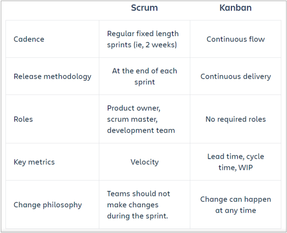

# Exercise 6

## 1. complete

1. The **(`.....`)** is responsible for quality in Agile projects.
2. XP teams use **(`.....`)** time to pay down **(`.....`)** by refactoring code or do research.
3. A cross-functional team in XP releases **(`.....`)** frequently.
4. Agile projects have short iterations; thus, project team receives **(`.....`)** and **(`.....`)** feedback on product quality throughout SDLC.
5. The general objective of **(`.....`)** is to visualize and optimize the flow of work within a value- added chain.
6. One programmer plays **(`.....`)** role and focuses on clean code, and compiles and runs. Second one plays role of **(`.....`)** and focuses on the big picture and reviews code for improvement or refactoring.
7. There are 2 levels of plans in XP: **(`.....`)** and **(`.....`)** In both levels, there are 3 steps: **(`.....`)**
8. User stories must address **(`.....`)** and **(`.....`)** characteristics. Each story includes **(`.....`)** for these characteristics used to decide when a task is **(`.....`)**
9. All team members, testers and non-testers, can **(`.....`)** on both testing and non-testing activities.

>> 1. **(`whole team`)**
>> 2. **(`slack time - technical debats`)**
>> 3. **(`Minimum Viable Product (MVP)`)**
>> 4. **(`early - continuous`)** 
>> 5. **(`kanban`)**
>> 6. **(`pilot - navigator`)**
>> 7. **(`release planning - iteration planning - exploration, commitment, and steering`)**
>> 8. **(`functional - non-functional - acceptance criteria - finished`)**
>> 9. **(`provide input`)**

## 2. replace with key terms

1. the team and stakeholders collaboratively decide what are the requirements and features that can be delivered into production and when.
2.  the team will pick up the most valuable items from the list and break them down into tasks then estimates and a commitment to delivering at the end of the iteration.
3. a naming conversion practice used in design and code to have a shared understanding between teams.
4. management approach used in situations where work arrives in an unpredictable fashion.
5. The value chain to be managed is visualized by a Kanban board. Each column shows a station. The items to be produced or tasks to be processed are symbolized by tickets.
6. The amount of parallel active tasks is strictly limited. This is controlled by the maximum number of tickets allowed for a station and/or globally for the board.
7. is the time between a request being made and a task being released.
8. is calculating the actual work-in-progress time.
9. is the agile form of requirements specifications explain how the system should behave with respect to a single, coherent feature or function.
10. Larger collections of related features, or a collection of sub-features that make up a single complex feature.
11. Collaborative authorship of the user story can use techniques such as brainstorming and mind mapping.
12. is a meeting held at the end of each iteration to discuss what was successful, what could be improved, and how to incorporate the improvements and retain the successes in future iterations.
13. XP teams conduct a small test or proof of concept workout

>> 1. `release planning`
>> 2. `Iteration planning`
>> 3. `System metaphor`
>> 4. `Kanban`
>> 5. `Kanban Board`
>> 6. `Work in Progress (WIP) Limit`
>> 7. `Kanban lead time`
>> 8. `Kanban cycle time`
>> 9. `User story`
>> 10. `Epics`
>> 11. `INVEST technique`
>> 12. `Retrospective`
>> 13. `Spike`

## 3. Mention Aspects of agile approaches

1. Agile approaches.
2. Collaborative user story creation.
3. Retrospectives.
4. Continues integration.
5. Release and iteration planning.

## 4. Mention agile software development approaches

1. Extreme programming (XP).
2. Scrum.
3. Kanban.

## 5. Mention XP Values

1. Communication.
2. feedback.
3. Simplicity.
4. Courage.
5. respect.

## 6. Identify Main planning process in XP practices

- Have 2 levels:
    1. release planning.
    2. iteration planning.
- Each level have 3 steps:
    1. Exploration.
    2. commitment.
    3. steering.

## 7. Compare between Scrum and Kanban

## 8. Explain INVEST

- I -> Independent
- N -> Negotiation
- V -> Value
- E -> Estimable
- S -> Small
- T -> Testable

## 9. Explain 3cs concepts

1. Card : the physical media describing a user story.
2. Conversation : explains how the software will be used.
3. Confirmation : The acceptance criteria.

## 10. Mention benefits of early and frequent feedback

1. avoiding requirements misunderstandings
2. clarifying customer feature requests
3. discovering and resolving quality problems early
4. providing information to agile team regrading its productivity
