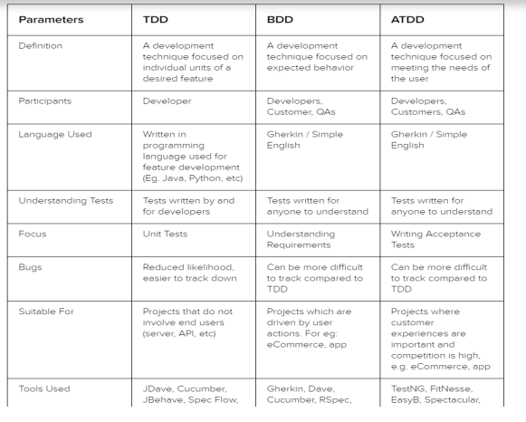

# Exercise 7

## 1. complete

1. When the regression testing is automated, the Agile testers are freed to concentrate their manual testing on **(`.....`)** and **(`.....`)** testing of defect fixes.
2. In agile projects, no feature is considered done until it has been **(`.....`)** and **(`.....`)** with the system.
3. **(`.....`)** iterations occur periodically to resolve any remaining defects and other forms of **(`.....`)**
4. Because of the heavy use of test automation, a higher percentage of the manual testing on Agile projects tends to be done using **(`.....`)** testing.
5. While developers will focus on creating unit tests, testers should focus on creating automated **(`.....`)** and **(`.....`)** tests.
6. Changes to existing features have testing implications, especially **(`.....`)** testing implications.
7. During an iteration, any given user story will typically progress sequentially through the following test activities: **(`.....`)** and **(`.....`)** .

>> 1. **`new feature implemented - confirmation`**
>> 2. **`integrated - tested`**
>> 3. **`stabilization - technical debt`**
>> 4. **`experienced based testing`**
>> 5. **`integration, system - system integration`**
>> 6. **`regression`**
>> 7. **`unit testing - feature acceptance testing`**

## 2. replace with key terms

1. occur periodically to resolve any remaining defects and other forms of technical debt.
2.  address defects remaining from the previous iteration at the beginning of the next iteration, as part of the backlog for that iteration.
3. is functional/feature testing of expected behaviors of an application as a whole.
4. involves cooperative stakeholders using plain language to write acceptance tests based on the shared understanding of user story requirements.
5. compare expected output with actual , mechanism that determines whether software executed correctly for a test case
6. A chart used to track progress across the entire release and within each iteration
7. lines of code added, modified, or deleted from one version to another 

>> 1. `Stabilization iterations`
>> 2. `fix bugs first`
>> 3. `Behavior-driven development (BDD)`
>> 4. `Acceptance test-driven development (ATDD)`
>> 5. `Test oracle`
>> 6. `Burndown charts`
>> 7. `code churn`

## 3. Automated activities of Continuous integration process 

1. Static code and analysis.
2. Compile.
3. Unit test.
4. deploy.
5. integration test.
6. Report.

## 4. Continuous Integration Challenges

1. CI tools have to be introduced and maintained.
2. CI process must be defined and established.
3. Test automation requires additional resources and can be complex to establish.
4. Thorough test coverage is essential to achieve automated testing advantages.
5. Teams sometimes over-rely on unit tests and perform too little systems and acceptance testing.

## 5. Test Activities During Iteration 

1. Unit testing.
2. Feature acceptance testing:
    - Feature verification testing.
    - Feature validation testing.
3. Regression testing (parallel through iteration).
4. System test level.

## 6. Categories of “project work products” of interest to Agile testers

1. Business-oriented work product.
2. Development work product.
3. Test work product.

## 7. Organizational Options for Independent Testing

1. embedded tester(s) within the team
   - risk of loss of independence and loss of objective evaluation
2. fully independent separate test team during the final days of each sprint
   - provide unbiased evaluation
   - time pressures, lack of understanding lead to problems with this approach
3. independent separate test team assigned to agile team on al long-term basis at the beginning of the project

## 8. Agile Testing Techniques

1. Test-driven development (TDD).
2. Acceptance test-driven development (ATDD).
3. Behavior-driven development (BDD).

## 9. TDD process

1. Add test.
2. watch test fail.
3. write code.
4. run test.
5. refactor.

## 10. TDD benefits

1. Code coverage.
2. regression testing.
3. simplifying debugging.
4. system documentation.

## 11. BDD format

1. Given (context)
2. When (the action the user performs)
3. Then (expected outcome)

## 12. Compare between TDD & BDD & ATDD

## 13. Mention Agile principle

1. Stabilization iterations
2. fix bugs first
3. Pairing
4. Test automation at all levels
5. Developers focus on creating unit tests
6. Testers should focus on creating automated tests
7. Lightweight work product documentation

## 13. benefits of automated tests

- provide rapid feedback on product quality
- provide a living document of system functionality
- automated unit test provide feedback on build quality but not on product quality.
8